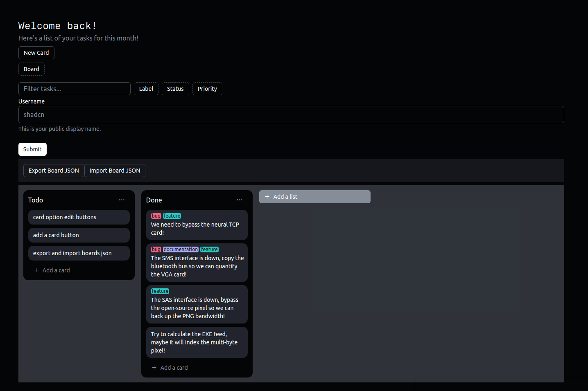
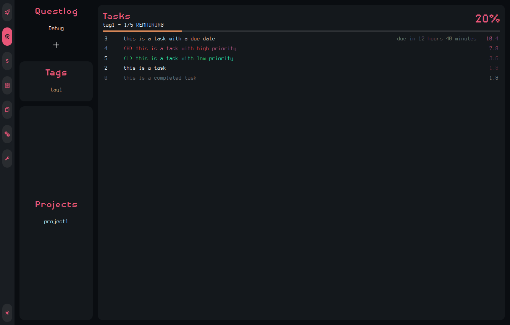
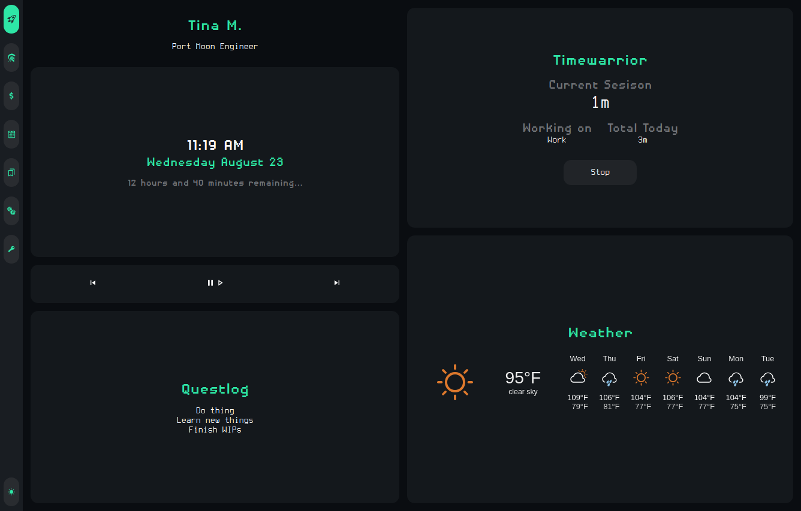

# Port Moon

<!-- > A Linux dashboard made using React Typescript & Electron (WIP) -->
> A ~~totally-not-a-trello-clone~~ task manager made using React Typescript & Electron (WIP)

<!-- My attempt at recreating [garado's cozy dashboard](https://github.com/garado/cozy) while learning about React and Electron. -->

## Usage
<!-- There are no released build yet. -->
I don't know how to build & release the project so
if you want to use it in the current version, you can do the following
```bash
# git clone & cd into the repo
git clone https://github.com/ganhaque/port-moon.git && cd port-moon

# install dependencies
npm install

# start the web version of the dashboard and run the electron version
npm run both
```
## New task manager screenshot


## Old Version Screenshot
### taskwarrior GUI


### Homepage & timewarrior GUI


<!-- ## Modules -->
<!---->
<!-- ### Quest -->
<!-- Parse and display a quests.txt file (future update: better location and editability) -->
<!---->
<!-- ### Timewarrior -->
<!-- Require timewarrior to be installed. Does nothing other wise. -->
<!---->
<!-- ### Taskwarrior (WIP) -->
<!-- Require taskwarrior to be installed. -->
<!-- Current iteration work but difficult to use. -->
<!---->
<!-- ### Commit Emoji -->
<!-- I use emoji for the git commit to shorten common commit like :feat, :fix, or added. -->
<!-- Here's the table to what each mean for now. -->
<!---->
<!-- | Emoji | Meaning | -->
<!-- |-------|---------| -->
<!-- :sparkles: | feat: added a new feature -->
<!-- :building_construction: | QoL changes, features to a previous feature -->
<!-- :wrench: | fix: generic fix -->
<!-- :bug: | fix: bug -->
<!-- :broom: | clean up / fix bad code -->
<!-- :fire: | clean up files -->
<!-- :memo: | add or update documentation -->
<!-- :construction: | WIP -->
<!-- :art: | generic improvement to the UI, theme -->
<!-- :zap: | code optimization -->
<!-- :recycle: | refactor code -->
<!-- :skull: | correct a mistake, I forgor :skull: -->
<!-- :tada: | new repo -->
<!---->
<!---->
